# kottans-frontend   [Kottans](https://kottans.org/)

## The repository is dedicated to taking part in [Kottans frontend course](https://github.com/kottans/frontend)
# Hello, my name is Volodymyr.

**This course is quite interesting. He improved my skills even more. Let's move on :)**

 1. **General**
    - [x] [Git Basics](#0-git-basics)
    - [x] [Linux CLI and Networking](#1-linux-cli-and-networking)
    - [x] [VCS (hello gitty), GitHub and Collaboration](#2-vcs-hello-gitty-github-and-collaboration)
  
 2. **Front-End Basics**

    - [x] [Intro to HTML & CSS](#3-intro-to-html-and-css)
    - [x] [Responsive Web Design](#5-responsive-web-design)
    - [x] [HTML & CSS Practice](#6-html-css-practice)
    - [x] [JavaScript Basics](#7-javascript-basics)
    - [x] [Document Object Model - practice](#8-document-object-model-practice)
  
 3. **Advanced Topics**

    - [x] [Building a Tiny JS World (pre-OOP) - practice](#9-building-a-tiny-js-world-pre-oop-practice)
    - [x] [Object oriented JS - practice](#10-object-oriented-js-practice)
    - [x] [OOP exercise - practice](#11-oop-exercise-practice)
    - [] [Offline Web Applications](#12-offline-web-applications)
    - [x] [Memory pair game — real project!](#13-memory-pair-game-real-project)
    - [] [Website Performance Optimization](#14-website-performance-optimization)
    - [x] [Friends App - real project!](#15-friends-app-real-project)

    # General
## Git Basics
[Introduction to Git and GitHub](https://learn.udacity.com/courses/ud123)

  

Screenshot

  

  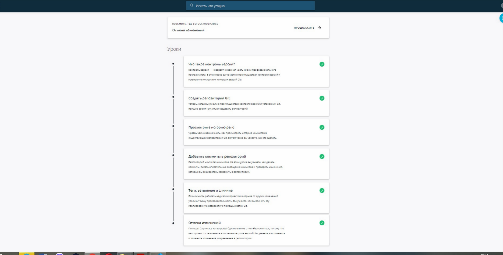

  

  

## Git Collaboration

**Almost everything was new to me, used 3-4 git commands before. Need to keep practicing**
[learngitbranching.js.org](https://learngitbranching.js.org/)  

 

Screenshot

  

  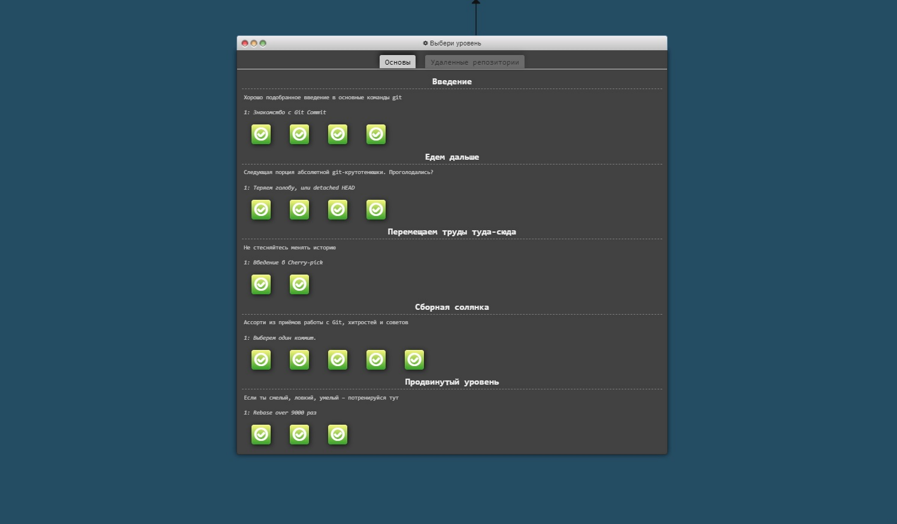
  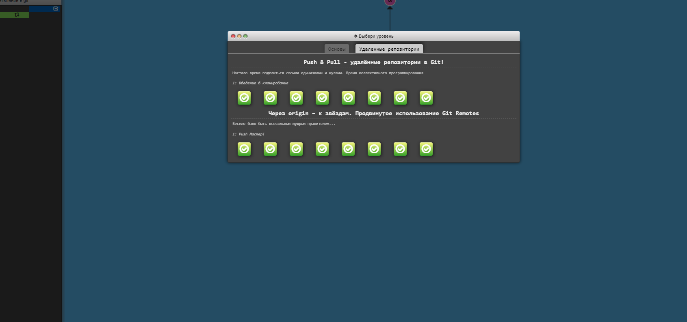

  

  

## Linux CLI and Networking

**It seems that he knew something from the commands, but he did not know much. I need to create a cheat sheet for commands**

[Linux, Command Line, HTTP Tools](https://linuxsurvival.com/linux-tutorial-end-of-module-4/)  

Screenshot

  

  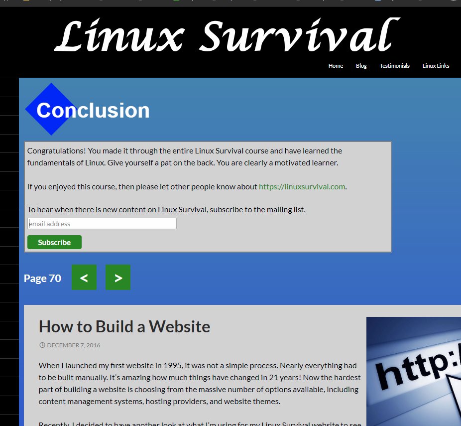

  

 
# Front-End Basics

## Intro to HTML and CSS

[1.Intro to HTML and CSS](https://www.codecademy.com/)

**Before that, I studied html and css, so I was a little bored**

Screenshot

  

  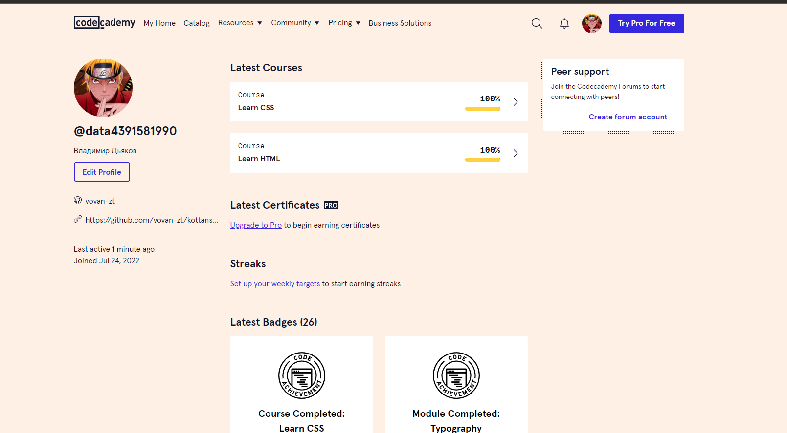

  

## Responsive Web Design

**Repeated the basics of flexbox and grid**

Screenshot

  

  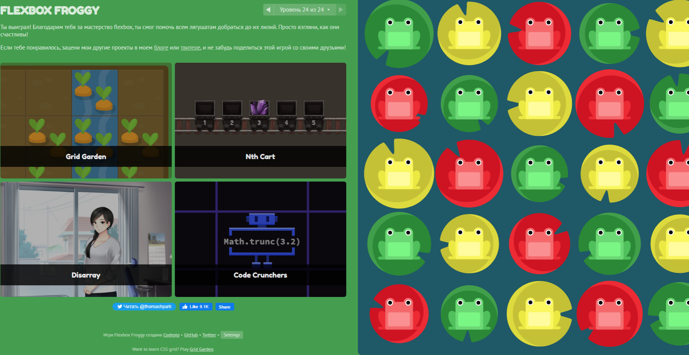
  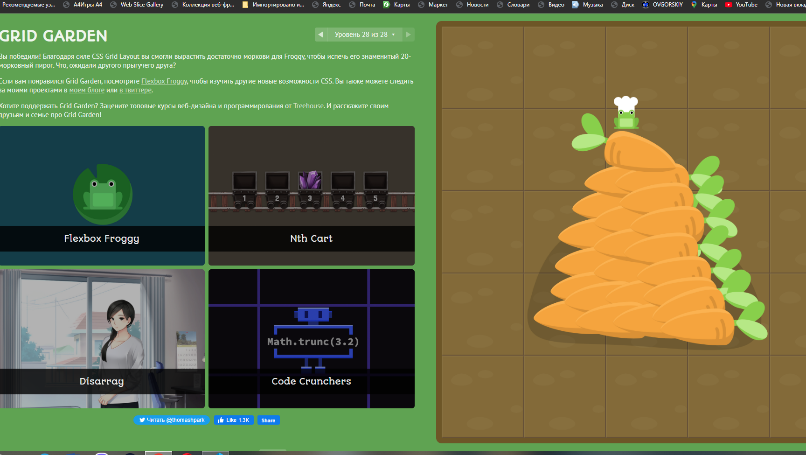
  
  

## HTML і CSS практика: Hooli-style Popup

**It would seem that it should be easy, but why is it so difficult?**

[https://github.com/vovan-zt/popup2022.git](https://github.com/vovan-zt/popup2022.git)  

[https://vovan-zt.github.io/popup2022/](https://vovan-zt.github.io/popup2022/)

## JS Basics

**It was interesting, I will definitely do the rest of the tasks as I progress through the course**

Screenshot

  

  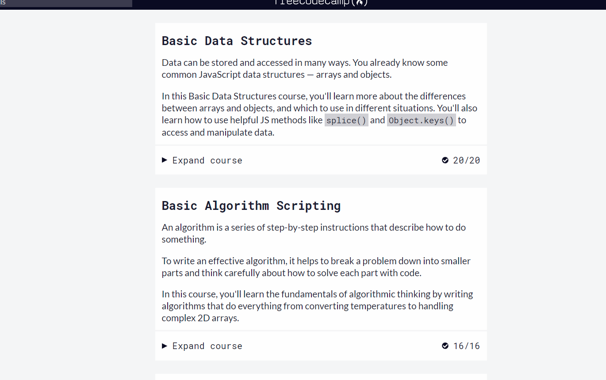
  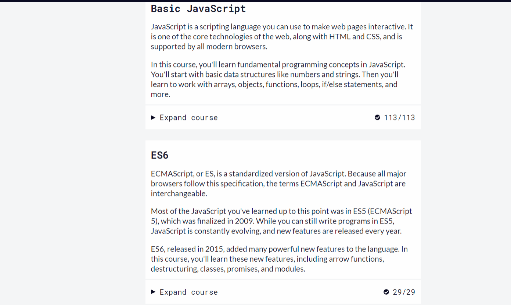
  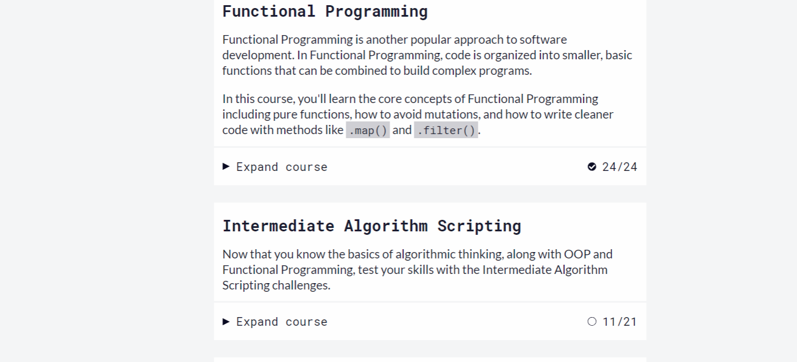

  

## DOM

**This task was easier for me than the previous one. But there are still many gaps and more practice is needed.**

Screenshot

  

  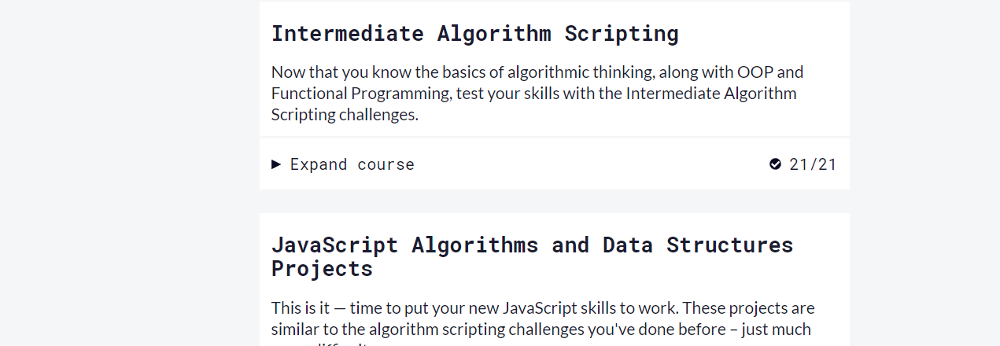

  

[https://github.com/vovan-zt/Action_menu.git](https://github.com/vovan-zt/Action_menu.git)    

[https://vovan-zt.github.io/Action_menu/](https://vovan-zt.github.io/Action_menu/dist)  
# Advanced Topics
## Building a Tiny JS World

**Interesting experience**

[https://vovan-zt.github.io/Action_menu/](https://github.com/vovan-zt/a-tiny-JS-world.git)  

[https://vovan-zt.github.io/a-tiny-JS-world/](https://vovan-zt.github.io/a-tiny-JS-world/) 

## Object Oriented JS

**I didn't like this job very much. It was very difficult to start writing something, despite the fact that most of the functionality was ready**

[codewars.com](https://www.codewars.com/users/VoVaN-zt/badges/large) 

Screenshot

  

  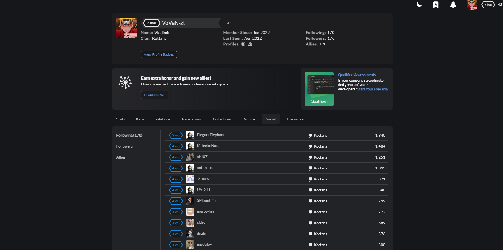

  

### Classic Arcade Game Clone Project
**I didn't like this job very much. It was very difficult to start writing something, despite the fact that most of the functionality was ready**

[https://vovan-zt.github.io/kottans-arcade-game/](https://vovan-zt.github.io/kottans-arcade-game/)  

[https://github.com/vovan-zt/kottans-arcade-game/](https://github.com/vovan-zt/kottans-arcade-game) 
## OOP exercise - practice
**There are some gaps in the understanding of the classes, but thanks to this project I have raised my level significantly higher**

[https://vovan-zt.github.io/Action_menu/](https://github.com/vovan-zt/a-tiny-JS-world.git)  

[https://vovan-zt.github.io/a-tiny-JS-world/](https://vovan-zt.github.io/a-tiny-JS-world/) 

## Offline Web Applications
**I am undergoing training**
## Memory Pair Game

  **It is interesting to create something and that it still works. My first card game. Additional features may be added in the future.**

[https://github.com/vovan-zt/Memory-Pair-Game](https://github.com/vovan-zt/Memory-Pair-Game)  

[https://vovan-zt.github.io/Memory-Pair-Game/dist](https://vovan-zt.github.io/Memory-Pair-Game/dist) 

## Website Performance Optimization
**I am undergoing training. Need more experience**

Screenshot

  

  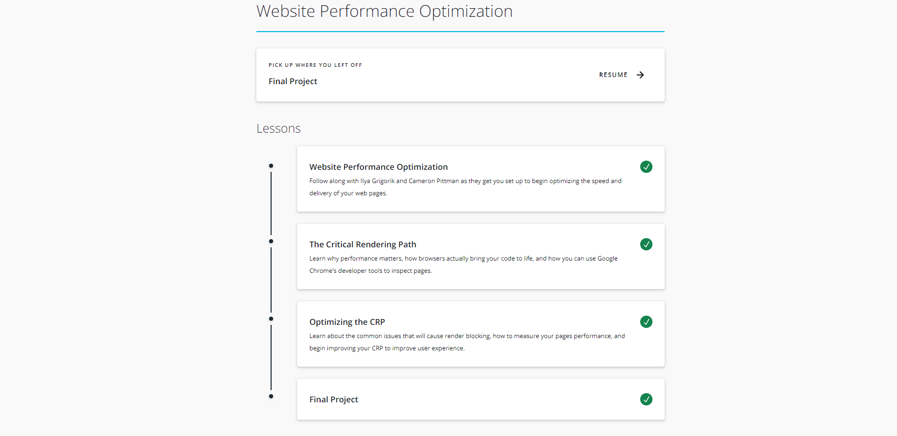

  

Remember ...

Скорость хостинга имеет важное значение. Вы можете иметь самый оптимизированный код на планете, но если вы хостинг с второй курс поставщика, который имеет значительное время задержки и медленное время, чтобы первый шаг (TTFB), ваши усилия по оптимизации будет в основном бесполезно. Вы запустите тесты производительности на основе метрик, чтобы определить самый быстрый веб-хостинг. Мониторинг производительности может быть настроен после этого, чтобы гарантировать, что ваша хостинговая компания работает в ногу со скоростью.
 

Ограничьте количество запросов, требуемых страницей. Каждый раз, когда пользователь отправляет запрос из браузера на сервер, он теряет драгоценные миллисекунды. Консолидирование элементов в отдельные файлы, такие как один файл СПРАЙТ CSS вместо десятков файлов изображений, вы ограничиваете количество запросов, которые сделает браузер
 

Создание файла СПРАЙТ CSS. Вместо загрузки десятков изображений для каждой страницы на вашем сайте, CSS спрайт файл должен требовать только одной загрузки. Это исключило бы необходимость иметь много более малых изображений для вещей как меню, округлые границы и изображения предпосылки. Суть файла СПРАЙТ CSS заключается в том, что вы складываете все изображения с вашего сайта в единый файл PNG и создаете ссылки на каждое местоположение изображения в CSS. Теперь, когда вам нужно отобразить изображение, вы просто называете класс CSS в теге div.
 

Используйте CSS, когда это возможно. Избавьтесь от стилей, изображений и другого контента, ехаемого на нескольких страницах вашего сайта.
 

Консолидируете листы стилей, чтобы был только один запрос CSS. Как только вы загружаете лист стиля, он устраняет будущие запросы на все элементы, связанные со стилем.
Одним из возможных исключений из правила одного листа стиля на сайте является оптимизация времени для взаимодействия или содержание «выше раза». Содержимое, которое появляется в верхней части страницы, что позволяет пользователю начать взаимодействие с сайтом должны быть приоритетными, когда вы обеспокоены тем, что пользователи будут отказов, если страница занимает слишком много времени для загрузки. В этом случае можно загрузить один файл CSS, чтобы правильно отобразить содержимое складок, а затем загрузить второй файл CSS, чтобы оптимизировать все остальное на странице.
 

Используйте сети доставки контента (CDNs). CDNs положить содержание веб-сайта, особенно большие изображения, видео и медиа-файлы как можно ближе к конечному пользователю, как это возможно. Вместо того, чтобы все пользователи называют элементы с вашего веб-сервера, они теперь скачать эти элементы с сервера CDN, который размещается всего в нескольких хопов в центре обработки данных вблизи их географического местоположения.
До тех пор, пока вы не пользователь более чем на пару доменов, разделение элементов между несколькими доменами (например, ваш базовый домен и CDN) будет максимизировать одновременные параллельные загрузки в браузере. В этот момент стоимость DNS поиск начинает рассчитывать против вас.
 

Свести к минимуму количество DNS-поисков, требуемых вашим сайтом. Каждый элемент, размещенный на уникальном домене, может потребовать дополнительного осмотра, который может добавить секунд к времени загрузки. Даже запросы на смежные домены (такие как www.example.com и css.example.com) по-прежнему требуют дополнительного запроса. Если это звучит нелогичным после того, как мы просто рекомендовали использовать CDNs, это потому, что не должно быть счастливой среде. Просто попробуйте ограничить количество дополнительных доменов, на которые ссылаются. Экстремальные оптимизаторы доходят до устранения всех кнопок социальных сетей, потому что они призывают к каждому домену.
 

Убедитесь, что ваш сервер позволяет кэширование браузера на основе возраста файла, истечения срока действия и Etag. Это означает, что любой контент, недавно загруженный браузером с сервера, например логотип компании, не будет загружаться снова до тех пор, пока он все еще действителен. Также убедитесь, что каждый элемент имеет надлежащий TTL, или возраст файла, чтобы воспользоваться кэшированием браузера.
 

Переместите JavaScript в нижнюю часть страницы. Это гарантирует загрузку содержимого перед ожиданием загрузки больших файлов JavaScript.
 

Если у вас есть возможность, консолидируете или устраните как можно больше плагинов JavaScript. Хотя это здорово для сбора данных о том, как ваши посетители используют ваш сайт, вы не хотите, чтобы сценарий сбора этих данных, чтобы замедлить ваш сайт и негативно повлиять на пользовательский опыт. Если вы собираетесь добавить новый плагин на веб-сайт, убедитесь, что вы не дублируете функциональность существующего плагина, и если вы, удалите старый плагин.
 

Используйте сжатие на вашем сайте. Использование gzip может значительно уменьшить общий размер файлов, которые вы отправляете с сервера в браузер. Сжатие часто обеспечивает более чем 70-процентное снижение пропускной способности использования.
 

Оптимизируйте размеры файлов, отправив только самый маленький размер изображения, требуемый страницей. Отредактировать изображение, чтобы быть точный размер пикселей, необходимых на странице. При выборе формата файла для изображений используйте PNG или JPEG, а не TIFFs и BMPs. Используйте инструмент сжатия изображений, такой как TinyPNG. Это отличный инструмент, чтобы уменьшить размер файла изображений, прежде чем положить их на вашем сайте. Также избегайте пустых тегов источника на изображениях. Пустой тег заставляет браузер отправлять дополнительный запрос на сервер.
 

Умитифицировать код. После завершения работы страницы запустите код-минификатор. Версия Google(https://developers.google.com/speed/docs/insights/MinifyResources),удаляет все ненужные код, такие как пустые пространства, пустые строки и т.д., экономя KBs размера файла.
 

Оптимизируйте базу данных. Если ваш сайт использует базу данных для размещения динамического содержимого, вы хотите убедиться, что база данных правильно проиндексированы. После индексации базы данных минимизировать количество вызовов, сделанных в базу данных. Например, если ваш сайт захватывает результаты из базы данных для отображения продуктов списка, повторно используйте результаты запроса, а не отправляете дополнительный запрос при бурении в подмножество результатов.
 

Мониторинг вашего сайта ежедневно для сломанных запросов. Если ваш сайт содержит код, который указывает на элемент, который больше не существует, ни на вашем сервере или от третьей стороны, то вы напрасно тратить время на отправку и ожидание 404 ошибок.
 

Бонусный совет! Регулярно тестируем свой сайт на совместимость в различных браузерах, включая различные мобильные платформы. Мобильные посетители начинают доминировать на рынке браузеров. Сосредоточьтесь на тестировании вашего сайта на мобильном телефоне перед рабочим столом.

## Friends App

  **Did everything in one file, not pretty but it works :)It was a little tricky with async functions. It takes more practice to understand them better.**

[https://github.com/vovan-zt/App_friends](https://github.com/vovan-zt/App_friends)  

[https://vovan-zt.github.io/App_friends/dist/](https://vovan-zt.github.io/App_friends/dist/) 
